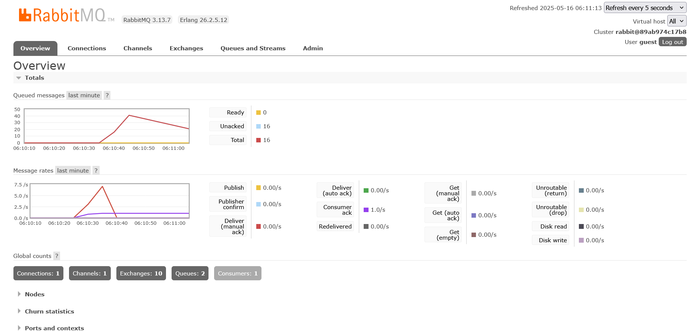

> 1. What is amqp?

AMQP adalah singkatan dari **Advanced Message Queuing Protocol**, yaitu protokol standar terbuka yang digunakan untuk middleware berbasis pesan. AMQP memungkinkan sistem untuk saling berkomunikasi dengan mengirim dan menerima pesan secara aman dan efisien. Protokol ini sering digunakan dalam sistem terdistribusi untuk memisahkan produsen (producers) dan konsumen (consumers) pesan, sehingga mendukung komunikasi asinkron.

> 2. What does it mean? guest:guest@localhost:5672 , what is the first guest, and what is the second guest, and what is localhost:5672 is for?

String ini adalah URI koneksi yang umum digunakan untuk terhubung ke broker AMQP, seperti RabbitMQ. Berikut penjelasan komponennya:
   - `guest` pertama adalah nama pengguna (username) yang digunakan untuk autentikasi.
   - `guest` kedua adalah kata sandi (password) yang terkait dengan nama pengguna tersebut.
   - `localhost` mengacu pada nama host atau alamat IP dari mesin tempat broker AMQP berjalan. Dalam hal ini, menunjuk ke mesin lokal (komputer yang sedang digunakan).
   - `5672` adalah nomor port default yang digunakan oleh broker AMQP untuk mendengarkan koneksi masuk.

Secara keseluruhan, URI ini menentukan kredensial dan lokasi jaringan yang diperlukan untuk membuat koneksi ke broker AMQP. Sebagai contoh, URI ini menginstruksikan klien untuk terhubung ke broker yang berjalan di mesin lokal (`localhost`) pada port `5672` dengan menggunakan nama pengguna `guest` dan kata sandi `guest`. 

## Simulation Slow Subscriber

Gambar tersebut menunjukkan tampilan dashboard RabbitMQ yang menampilkan informasi sistem secara real-time, termasuk jumlah antrean (queue) yang aktif, yaitu sebanyak 2 antrean. Jumlah antrean ini menunjukkan ada dua antrean yang telah dibuat dan masih aktif di dalam broker RabbitMQ, baik karena dibuat secara eksplisit oleh aplikasi publisher maupun karena subscriber terhubung ke antrean yang berbeda. Perlu dicatat, angka ini tidak merepresentasikan jumlah pesan yang ada, melainkan hanya jumlah antrean yang tersedia di broker, terlepas dari apakah antrean tersebut sedang kosong atau berisi pesan